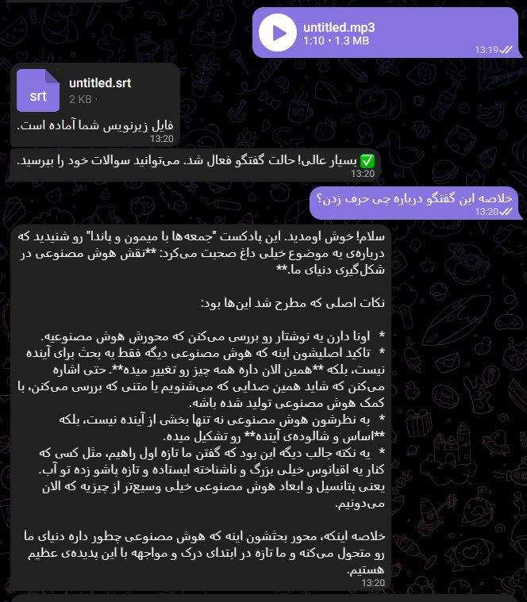

# Conversational AI Voice Analyst (Telegram Bot)

This repository contains the source code for a sophisticated Telegram bot that transforms audio and video files into intelligent, interactive conversations. The bot leverages a multi-stage processing pipeline, including speaker diarization and a stateful conversational agent built with **LangGraph** and powered by **Google's Gemini 2.5 Flash**, to provide deep analysis of spoken content.

## 🖼️ Bot Preview Gallery

Place your screenshots in an `assets` folder in the project root to display them here.

*(**Instructions:** Replace the placeholder paths below with the actual paths to your screenshots in the `assets` folder.)*

<table align="center">
  <tr>
    <td align="center"><strong>Screan from Bot</strong></td>
  </tr>
  <tr>
    <td></td>
  </tr>
</table>

## 🚀 Key Features

-   **Multi-Format Support:** Processes both audio (`.mp3`, `.ogg`, `.wav`) and video (`.mp4`, `.mkv`, `.mov`) files seamlessly.
-   **Speaker Diarization:** Automatically identifies and labels different speakers in the conversation using the cutting-edge `pyannote.audio` library.
-   **Accurate Transcription:** Generates a full, time-stamped transcript and provides it as a downloadable `.srt` (subtitle) file.
-   **Stateful Conversational Memory:** Users can engage in a natural, context-aware dialogue about the transcript. The agent, built with **LangGraph**, remembers the conversation history for intelligent follow-up questions.
-   **Advanced AI Analysis:** Powered by a **LangGraph** agent and the **Gemini 2.5 Flash** model, the bot can:
    -   Summarize long conversations or a specific speaker's points.
    -   Identify key topics, themes, and viewpoints.
    -   Answer specific questions about what each speaker said (e.g., "What was SPEAKER_01's opinion on the marketing strategy?").
    -   Extract insights and analyze the content beyond simple text retrieval.

## 🏛️ Architecture & How It Works

The bot follows a robust, event-driven pipeline:

1.  **File Reception:** The user uploads an audio or video file to the Telegram bot.
2.  **Preprocessing:** Audio is extracted (if from video) and standardized into a 16kHz mono WAV format for optimal processing.
3.  **Speaker Diarization:** The `pyannote/speaker-diarization-3.1` model processes the audio to determine *who* spoke and *when*.
4.  **Transcription (STT):** The audio is chunked based on speaker turns, and each segment is transcribed to text using Google's Speech Recognition API.
5.  **Output Generation:** A complete transcript is assembled and also formatted into a `.srt` file, which is sent to the user.
6.  **Interactive Analysis:** The full transcript is loaded into the **LangGraph** agent's state as its "single source of truth." The user can then initiate a chat, where the Gemini model uses the transcript to answer questions. Each conversation is maintained in a persistent state using LangGraph's memory features.

## 🛠️ Tech Stack

-   **Bot Framework:** `python-telegram-bot`
-   **AI & Agent Framework:**
    -   **LangGraph:** For building stateful, multi-actor AI applications.
    -   **LLM:** Google `Gemini 2.5 Flash` via `langchain_google_genai`.
-   **Audio Processing:**
    -   **Speaker Diarization:** `pyannote.audio` (Hugging Face)
    -   **Speech-to-Text (STT):** `speech_recognition` (Google STT API)
    -   **Audio Manipulation:** `MoviePy`, `pydub`, `librosa`

## 🔧 Local Setup and Installation

1.  **Clone the Repository:**
    ```bash
    git clone https://github.com/YOUR_USERNAME/your-repo-name.git
    cd your-repo-name
    ```

2.  **Create and Activate a Virtual Environment:**
    ```bash
    python -m venv venv
    source venv/bin/activate  # On Windows use: venv\Scripts\activate
    ```

3.  **Install Dependencies:**
    ```bash
    pip install -r requirements.txt
    ```
    *(Note: You may need to install `ffmpeg` and `PyTorch` separately depending on your system. Please refer to their official documentation for instructions.)*

4.  **Configure Environment Variables:**
    Create a `.env` file by copying the provided template:
    ```bash
    cp .env 
    ```
    Next, open the `.env` file and fill in your actual API keys for Telegram, Hugging Face, and Google Gemini.

5.  **Run the Bot:**
    ```bash
    python main.py
    ```

## 🤝 Contributing

Contributions, issues, and feature requests are welcome. Feel free to check the [issues page](https://github.com/YOUR_USERNAME/your-repo-name/issues) if you'd like to collaborate.

## 📜 License

This project is licensed under the MIT License. See the `LICENSE` file for more details.
